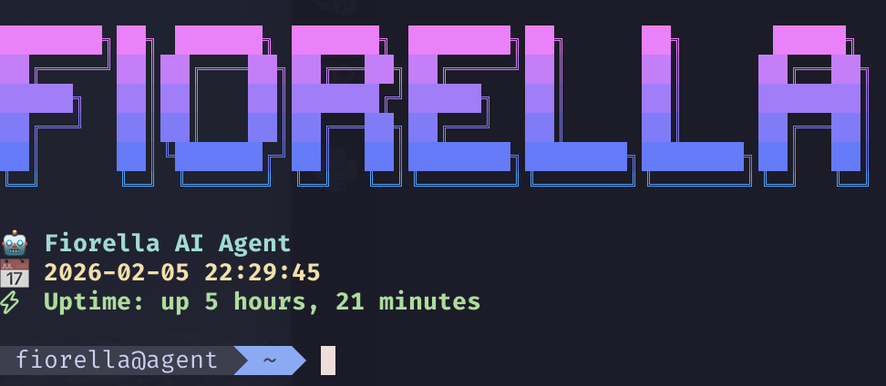

# Agent



This repository contains the complete configuration for Fiorella's development and automation environment, who is Matthieu's AI agent (a useful assistant). But there's also Claude, Copilot, Codex, Ralph and all the others.

## Get started

```bash
# Run to create agent
curl -fsSL https://raw.githubusercontent.com/matthieumota/agent/refs/heads/main/install.sh | bash -s setup

# Login as agent
ssh fiorella@vps

# Generate a ssh key and add to agent's Github account
ssh-keygen -t ed25519 -C "fiorella@boxydev.com"
cat /home/fiorella/.ssh/id_ed25519.pub

# Run after logged as agent
curl -fsSL https://raw.githubusercontent.com/matthieumota/agent/refs/heads/main/install.sh | bash
```

## Auth Github

We can authenticate on agent's Github account :

```bash
gh auth login
```

## Browser

Agent can use local browser :

```bash
google-chrome-stable --remote-debugging-port=9222 --user-data-dir=/tmp/chrome-debug
ssh -R 9222:127.0.0.1:9222 -N fiorella@vps
```
